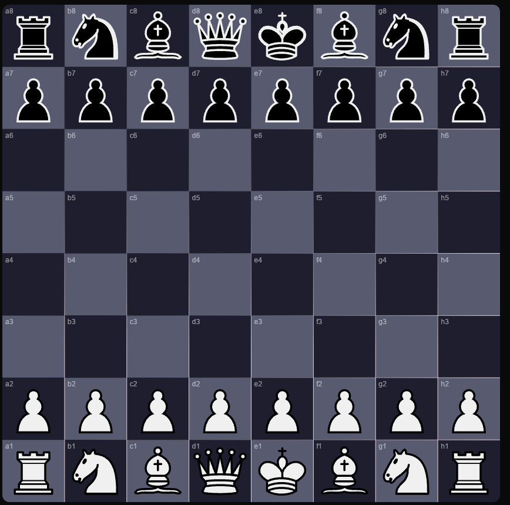
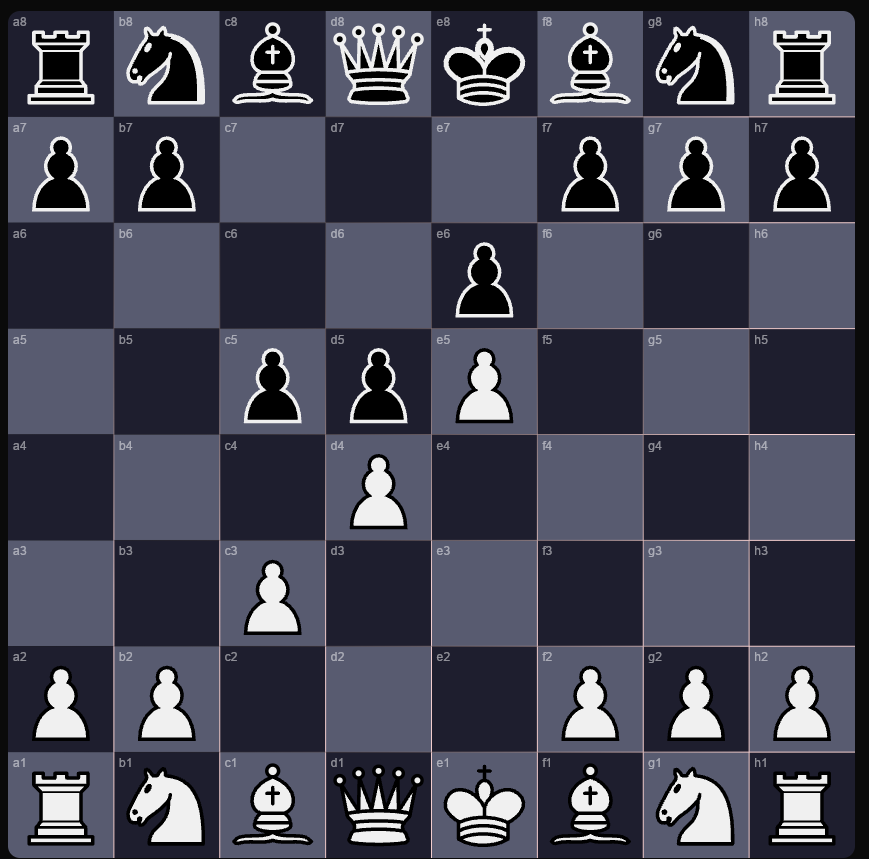

# Chess

Welcome to the Chess project! This repository contains the code for a chess game implemented in [your programming language of choice].

## Features

- Play against the computer or another player
- Save and load games
- Undo and redo moves
- Highlight possible moves
- Customizable board and pieces

## Screenshots

Here are some screenshots of the game in action:

## Links

- [Website](https://acole-chess.app)
- [Help Site](https://help.acole-chess.app)
## License

This project is licensed under the MIT License. See the [LICENSE](LICENSE) file for details.

## Contact

For any questions or suggestions, please open an issue or contact [Aaron@acole-chess.app].

Enjoy playing chess!